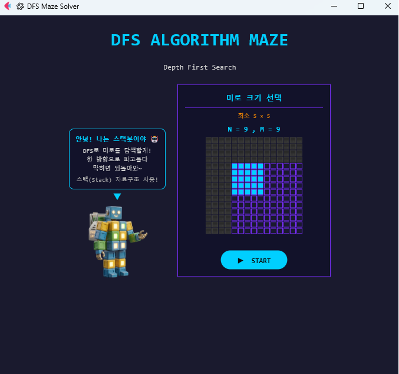
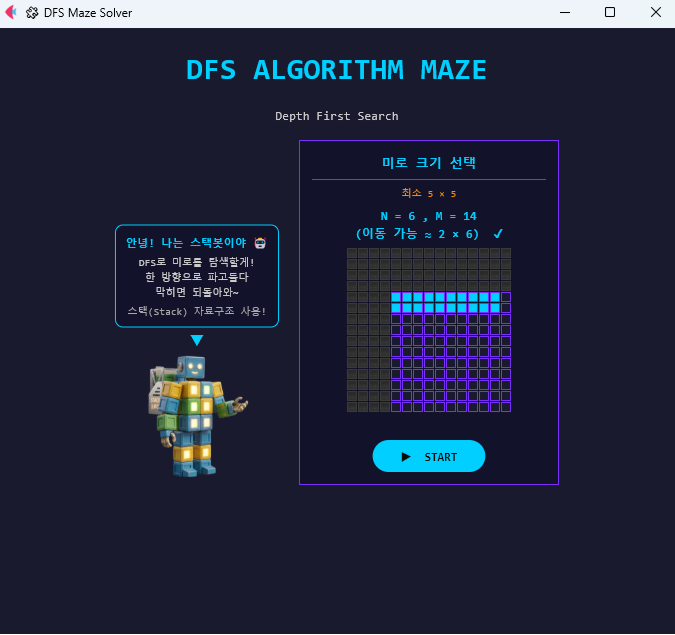
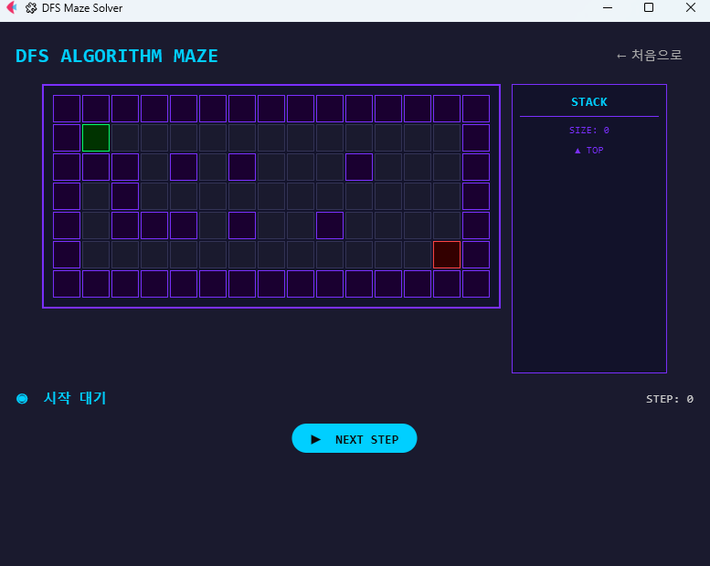
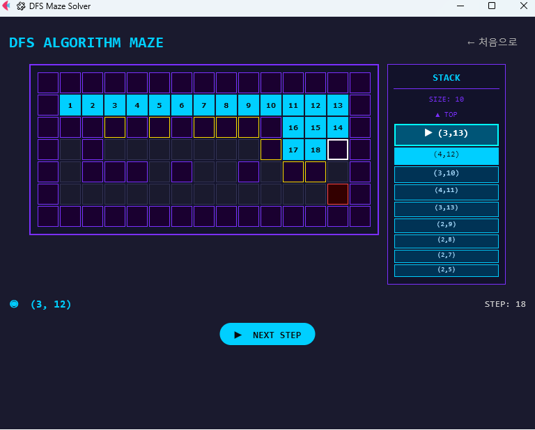
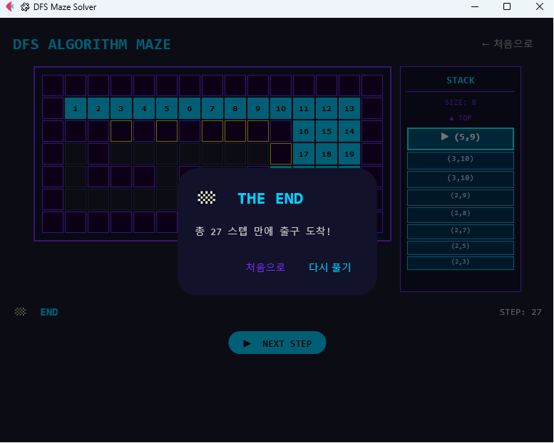

# 🧩 DFS Algorithm Maze
> DFS Maze Visualization built using Python & Flet

 

---

## 📌 소개

Python과 Flet 프레임워크를 사용하여 만든 **깊이 우선 탐색(DFS) 미로 시각화 앱**입니다.  
스택(Stack) 자료구조를 활용한 DFS 알고리즘의 탐색 과정을 단계별로 확인할 수 있으며,  
매번 새로운 미로가 자동 생성됩니다.

---

## 📷 실행 화면

| 시작 화면 (기본) | 시작 화면 (크기 선택) |
|-----------|-----------|
|  |  |

| 탐색 전 | 탐색 중 |
|-----------|-----------|
|  |  |

| 완료 화면 |
|-----------|
|  |

---

## ✨ 주요 기능

- 🎮 **미로 크기 선택** — 격자 셀 클릭으로 N×M 크기 선택 (최소 5×5, 최대 15×15)
- 🔍 **단계별 탐색** — NEXT STEP 버튼으로 DFS 알고리즘을 한 스텝씩 시각화
- 📦 **스택 시각화** — 우측 패널에서 현재 스택 상태 실시간 확인
- 🔄 **미로 자동 생성** — DFS 백트래킹 + 랜덤 루프 추가로 매번 새로운 미로 생성
- 🏁 **완료 팝업** — 출구 도착 시 스텝 수와 함께 결과 표시
- ↩️ **처음으로 / 다시 풀기** — 완료 후 시작 화면으로 돌아가거나 동일 미로 재도전

---

## 🎨 색상 범례

| 색상 | 의미 |
|------|------|
| 🟣 보라 테두리 | 벽 |
| 🟢 초록 | 시작점 |
| 🔴 빨강 | 출구 |
| 🩵 시안 | 탐색 중 (방문한 셀 + 순서 번호) |
| 🟠 주황 | 백트래킹 (막힌 셀 ✕) |
| 🟡 노랑 테두리 | 스택 후보 셀 |
| ⬜ 흰 테두리 | 다음 탐색 1순위 셀 |
| 🔵 청록 | 출구 도착 (★) |

---

## 🚀 설치 및 실행

### 요구사항

- Python 3.10 이상
- Flet 0.80.0 이상

### 설치

```bash
pip install flet
```

### 실행

```bash
# uv 사용 시 (권장)
uv run --with flet python main.py

# 가상환경 사용 시
python -m venv .venv
.venv\Scripts\activate      # Windows
pip install flet
python main.py
```

---

## 🎮 사용법

### 미로 크기 선택
```
시작 화면에서 격자 셀을 클릭하여 크기 선택
클릭 시 선택된 크기 미리보기 표시
▶ START 버튼 클릭으로 확정 및 미로 화면 전환
최소 5×5, 최대 15×15
```

### 탐색 진행
```
▶ NEXT STEP — 한 스텝씩 탐색 진행
우측 STACK 패널 — 현재 탐색 후보 좌표 확인
← 처음으로 — 시작 화면으로 돌아가기
```

### 완료
```
출구(★) 도착 시 THE END 팝업 표시
총 스텝 수 확인 후 처음으로 / 다시 풀기 선택
```

---

## 🧠 알고리즘 설명

DFS(깊이 우선 탐색)는 **스택(Stack)** 자료구조를 활용합니다.

```
1. 시작점을 스택에 push
2. 스택에서 pop → 현재 셀 방문
3. 현재 셀의 이웃(상하좌우)을 스택에 push
4. 스택이 빌 때까지 반복
5. 출구 도달 시 탐색 종료
```

한 방향으로 끝까지 파고들다가 막히면 되돌아와(백트래킹) 다른 경로를 탐색합니다.

---

## 🗂️ 파일 구조

```
DFS_MAZE/
├── main.py                            # 진입점
├── maze_logic.py                      # DFS 알고리즘, 미로 생성, 스택 자료구조
├── maze_screen.py                     # 미로 탐색 화면 UI
├── start_screen.py                    # 시작 화면 UI
├── utils.py                           # 공통 상수 및 유틸 함수
├── robot.png                          # 스택봇 이미지
├── images/
│   ├── screenshot_start_default.png   # 시작화면 기본
│   ├── screenshot_start_select.png    # 시작화면 크기 선택
│   ├── screenshot_maze_before.png     # 탐색 전
│   ├── screenshot_maze_during.png     # 탐색 중
│   └── screenshot_maze_end.png        # 완료화면
└── README.md
```

---

## 🛠️ 기술 스택

- **Language** — Python 3
- **UI Framework** — Flet
- **Algorithm** — DFS (Depth First Search)
- **Data Structure** — Stack (ADT 직접 구현)

---

## 👩‍💻 개발자

- GitHub: [@Jenny5789](https://github.com/Jenny5789)
